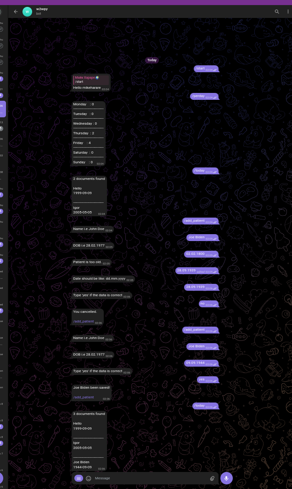

# Way2Win.ru Interview Assignment

Develop a Python Telegram bot for a medical institution. The doctor/user should be able to add patients data. The patients data is full name and date of birth. Patients cannot be over a 100 years old. Data should be confirmed before saved.

## How to run

1. Create a file called ".env" in the root folder. Same level as .gitignore and docker-compose.yml.
2. Add two variables `BOT_NAME=xxxxxxxx` and `BOT_TOKEN=00000000:aaaa`
3. In your terminal run the command: `docker compose -f "docker-compose.yml" up -d --build`

## Technologies

I used the technologies highlghted in the assignment description, namely Python and Aiogram.

1. Python (A trendy easy to write and read multi purpose programming language)
2. Aiogram (Asynchronous Python HTTP library for the Telegram API)
3. MongoDB (A popular NoSQL database engine)
4. Docker (A tool for containerizing software projects)

## Improvements

The task is an interview assignment, it is not a production ready application. Here are some of the things that can be done.

1. Write unit tests using Pytest
2. Write a CI/CD pipeline
3. Use a self hosted Mongo database
4. Add middleware for the bots own security since write now everyone can be a user and manipulate the data.

I hope and trust that this project demonstrates my good grasp of the Python programming language.

Warm regards,

Mike Zinyoni (7+ Years of Python Programming experience. (Wow!!!))
